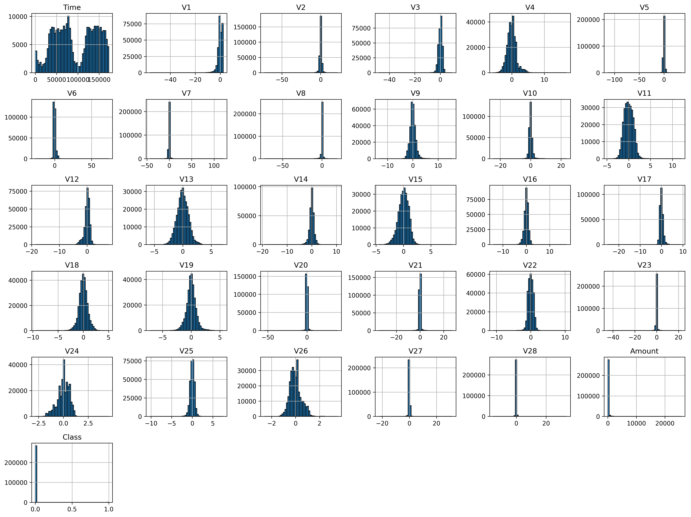
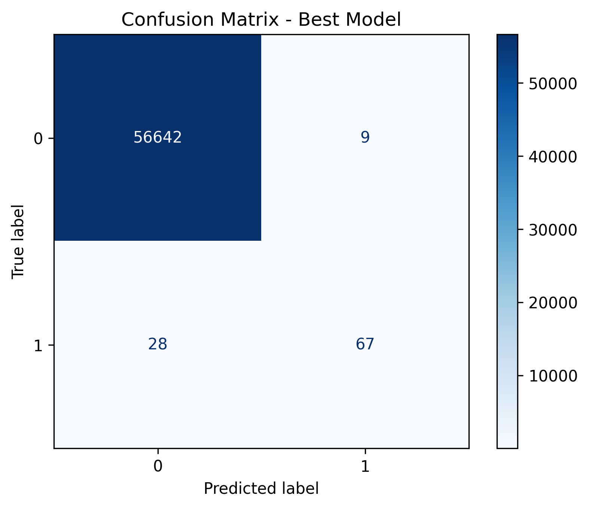
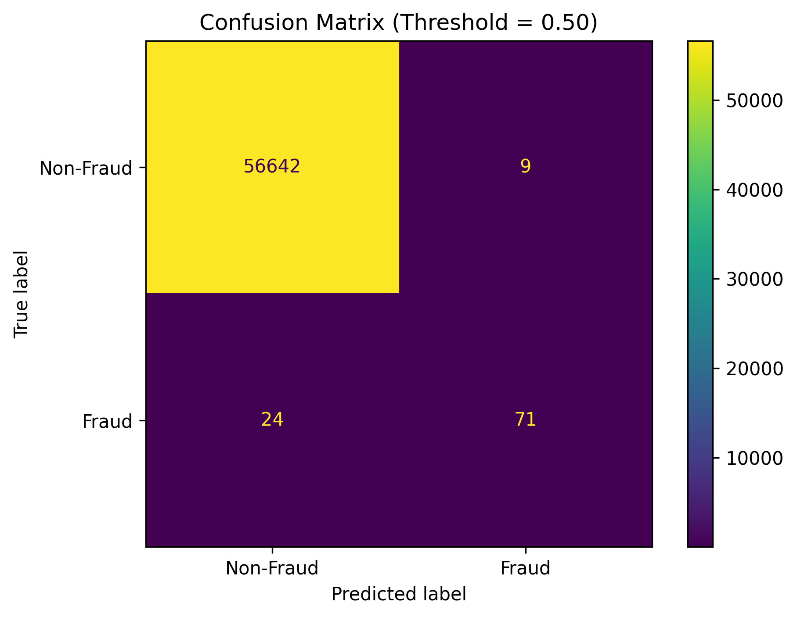

# 🚀 Maktab First Mini Project — Fraud Detection

## Problem Description

This project explores several machine learning models for **credit card fraud detection** and investigates how different preprocessing techniques, model choices, and evaluation metrics affect performance.

## Data Analysis

The dataset contains credit card transactions made by European cardholders in September 2013.

It contains:
- $284807$ samples
- $31$ columns which $30$ of them are `features` and last columns is `target` named `Class`.
- It has $1854$ duplicate rows which were removed in preprocessing step.
- Two preprocessed dataset are created. One is just created buy standard scaling and the other first was added two similarity time columns and removed time column.
- Dataset has two targets. 
  
```plain
0 → Legitimate transaction
1 → Fraudulent transaction
```

- Count of each targets are:

```plain
0    284315
1       492
```

---

## Feature Engineering

### Time Feature Analysis

The `Time` feature showed a bimodal distribution, with two distinct modes. This suggests that the transaction times are not distributed uniformly and that the distance of a transaction from these two modes may contain useful information for fraud detection.



To capture this structure, I created two new features using kernel-based similarity functions. Each feature represents the similarity of a transaction's `Time` value to one of the two identified modes.

In addition, I used **Isolation Forest** to generate an anomaly-related feature. This feature provides the models with additional information about how unusual a transaction is compared with the rest of the dataset.

The resulting feature-engineered dataset therefore contains:

- Two kernel-based similarity features derived from `Time`.
- One Isolation Forest anomaly feature.
- The original `Time` feature removed after extracting the relevant information from it.

This feature-engineered dataset is provided alongside the standard-scaled dataset, allowing the models to be evaluated and compared using both feature representations.

---

## 🎯 Guiding Questions

### 1. Which model do you expect to perform best for fraud detection? Why?

**Random Forest**.

I expect Deep Model to perform well because it has great capability of learning non-linear patters and learn more complex patters.

---

### 2. Which metric is more important for this problem: Precision, Recall, or F1-score? Why?

For this particular problem, I consider **Recall** to be the most important metric.

In fraud detection, we want to minimize the number of fraudulent transactions that the model fails to detect. In other words, we don't want fraudulent transactions to **escape detection**.

A false positive (legitimate transaction classified as fraud) can be investigated further, while a false negative (fraud classified as legitimate) means the fraudulent transaction may go completely undetected.

Therefore, I would prioritize **high Recall**, while still monitoring Precision to make sure the number of false alarms remains reasonable.

> **Goal:** Detect as many fraudulent transactions as possible while keeping false positives manageable.

---

### 3. What do you expect to happen if the model predicts all transactions as legitimate?

If the model predicts every transaction as legitimate:

- **Accuracy** may appear very high because fraud transactions are extremely rare.
- **Precision** becomes undefined or effectively unusable because the model never predicts the positive class.
- **Recall** becomes **0**, because the model detects none of the fraudulent transactions.
- **F1-score** also becomes **0**.

Therefore, a very high accuracy in this situation would be misleading.

This demonstrates why **accuracy alone is not a suitable metric for highly imbalanced fraud detection problems**.

---

### 4. Do you expect feature scaling to significantly affect KNN performance?

**Yes.**

KNN relies heavily on **distance calculations** to determine which observations are similar to each other.

If features have significantly different scales, features with larger numerical ranges can dominate the distance calculation.

For example:

```text
Feature A: 0.0  → 1.0
Feature B: 0   → 100,000
```

---

### 5. Was your initial hypothesis correct?
My initial hypothesis was partially correct. I expected the Deep Model to perform well because deep neural networks can learn complex non-linear relationships between features. This expectation was supported by the results, as the Deep Model achieved the best overall performance according to PR-AUC. However, Logistic Regression also performed surprisingly well and achieved a higher Recall while requiring significantly less training time and memory

---

### 6. Which model performed best?
The Deep Model performed best according to PR-AUC, making it the strongest model for overall fraud detection performance in this experiment. However, Logistic Regression achieved higher Recall and required significantly less computational resources. Therefore, the Deep Model was the best-performing model according to the selected metric, while Logistic Regression may be a more practical choice when computational efficiency and fraud detection Recall are prioritized.

---

### 7. Which metric was most informative?
PR-AUC was the most informative metric. Since fraudulent transactions represent only a very small fraction of all transactions, ROC-AUC and especially Accuracy can sometimes give an overly optimistic impression of model performance. PR-AUC focuses more directly on the model's ability to identify the positive class while maintaining reasonable precision.

---

### 8. How did class imbalance affect the results?
Class imbalance strongly affected the results. Fraudulent transactions represent only a very small portion of the dataset. If the classes are treated equally in the loss function, the large number of legitimate transactions has a much greater influence on the model's learning process. As a result, a model can achieve very high accuracy by mostly predicting transactions as legitimate while still performing poorly at detecting fraud. This is why metrics such as Recall, F1-score, and particularly PR-AUC are more informative for this problem.

---

### 9. What was the trade-off between False Positives and False Negatives?
There is a trade-off between False Positives and False Negatives. Improving the detection of fraudulent transactions can increase False Positives, while reducing False Positives can lead to more fraudulent transactions being missed. Therefore, we need to find a suitable balance between detecting fraud and avoiding false alarms.

## Confusion Matrix Analysis

The confusion matrices below show how each model classifies legitimate and fraudulent transactions. In addition to the confusion matrices, the best hyperparameters found during model tuning and the final performance on the test data are reported for each model.

Because the dataset is highly imbalanced, **Recall, Precision, F1-score, and PR-AUC** are particularly important when evaluating fraud detection performance.

---

### Logistic Regression

#### Best Hyperparameters

| Dataset | Best Parameters |
|---|---|
| Standard-scaled dataset (`log_regr1`) | `C=1`, `class_weight={0: 1, 1: 5}` |
| Time/Isolation-Forest dataset (`log_regr2`) | `C=10`, `class_weight={0: 1, 1: 5}` |

#### Test Performance

| Metric | Standard-scaled (`log_regr1`) | Time/Isolation-Forest (`log_regr2`) |
|---|---:|---:|
| Accuracy | 0.9993 | 0.9993 |
| Precision | 0.8256 | 0.8256 |
| Recall | 0.7474 | 0.7474 |
| F1-score | 0.7845 | 0.7845 |
| ROC-AUC | 0.9627 | 0.9690 |
| PR-AUC | 0.7004 | 0.7046 |

**Test-set interpretation:**  
Logistic Regression achieved very high Accuracy and ROC-AUC on both datasets. Its Recall of **0.7474** means that it detected approximately 75% of the fraudulent transactions. The feature-engineered dataset produced a slightly higher ROC-AUC and PR-AUC, suggesting a small improvement in the model's ability to rank fraudulent transactions above legitimate ones.

**Confusion matrix for standard-scaled dataset**


**Confusion matrix for time/Isolation-Forest dataset**


---

### Decision Tree

#### Best Hyperparameters

| Dataset | Best Parameters |
|---|---|
| Standard-scaled dataset (`dt1`) | `class_weight=None`, `max_depth=5`, `max_features=None`, `min_samples_split=2` |
| Time/Isolation-Forest dataset (`dt2`) | `class_weight=None`, `max_depth=5`, `max_features=None`, `min_samples_split=2` |

#### Test Performance

| Metric | Standard-scaled (`dt1`) | Time/Isolation-Forest (`dt2`) |
|---|---:|---:|
| Accuracy | 0.9993 | 0.9994 |
| Precision | 0.8816 | 0.9041 |
| Recall | 0.7053 | 0.6947 |
| F1-score | 0.7836 | 0.7857 |
| ROC-AUC | 0.9060 | 0.8955 |
| PR-AUC | 0.6416 | 0.6623 |

**Test-set interpretation:**  
The Decision Tree achieved very high Accuracy on both datasets. The feature-engineered dataset improved Precision from **0.8816 to 0.9041** and slightly improved F1-score from **0.7836 to 0.7857**. However, Recall decreased from **0.7053 to 0.6947**, meaning that the feature-engineered version detected slightly fewer fraudulent transactions. The PR-AUC increased from **0.6416 to 0.6623**, indicating an improvement in the overall precision-recall trade-off.

**Confusion matrix for standard-scaled dataset**



**Confusion matrix for time/Isolation-Forest dataset**


---

### KNN

#### Best Hyperparameters

| Dataset | Best Parameters |
|---|---|
| Standard-scaled dataset (`knn1`) | `n_neighbors=9`, `p=1`, `weights='distance'` |
| Time/Isolation-Forest dataset (`knn2`) | `n_neighbors=7`, `p=1`, `weights='distance'` |

#### Test Performance

| Metric | Standard-scaled (`knn1`) | Time/Isolation-Forest (`knn2`) |
|---|---:|---:|
| Accuracy | 0.9995 | 0.9995 |
| Precision | 0.9571 | 0.9571 |
| Recall | 0.7053 | 0.7053 |
| F1-score | 0.8121 | 0.8121 |
| ROC-AUC | 0.9051 | 0.8998 |
| PR-AUC | 0.7892 | 0.7855 |

**Test-set interpretation:**  
KNN achieved the highest test Precision among the three reported models, at **0.9571**, while maintaining a Recall of **0.7053**. Its F1-score was **0.8121** for both datasets. The standard-scaled dataset produced slightly better ROC-AUC and PR-AUC than the feature-engineered dataset, suggesting that the additional time-based features did not improve KNN's overall test performance.

**Confusion matrix for standard-scaled dataset**


**Confusion matrix for time/Isolation-Forest dataset**


---

### Deep Model

### Deep Model

A fully connected neural network was developed for fraud detection. The model architecture was selected through a **5-fold cross-validation experiment**.

Five different hidden-layer configurations were evaluated:

- `[32, 32]`
- `[64, 32]`
- `[64, 64]`
- `[128, 64]`
- `[128, 128]`

The architecture **[128, 128]** was selected as the best-performing configuration based on the cross-validation experiments. The final network therefore consists of two hidden layers with 128 neurons each and a single output neuron.

#### Final Architecture

```text
Input
  │
  ▼
Dense Layer (128 neurons)
  │
  ▼
Dense Layer (128 neurons)
  │
  ▼
Output Layer (1 neuron, Sigmoid)
```

The Sigmoid output produces a probability between 0 and 1, which is used to determine whether a transaction is legitimate or fraudulent.

The architecture was evaluated using **5-fold cross-validation**, with **PR-AUC** used as the primary criterion for selecting the best model during training. The best-performing epoch was retained for each fold based on validation PR-AUC. This approach helps select a model that performs well on the minority fraud class rather than relying solely on Accuracy, which can be misleading for this highly imbalanced dataset. :contentReference[oaicite:0]{index=0}

#### Cross-Validation Results

During cross-validation, the model was evaluated using Accuracy, Precision, Recall, F1-score, ROC-AUC, and PR-AUC. For example, one of the selected folds achieved:

| Metric | Validation Result |
|---|---:|
| Accuracy | 0.9994 |
| Precision | 0.8400 |
| Recall | 0.8289 |
| F1-score | 0.8344 |
| ROC-AUC | 0.9811 |
| PR-AUC | 0.8056 |

The best epoch for this fold was selected based on its validation PR-AUC, with the best recorded value being **0.8121**. :contentReference[oaicite:1]{index=1}

#### Final Model: Standard-Scaled Features

**Architecture**: `[128, 128]`

**Training samples**: `226,980`

**Epochs**: `20`

The final model achieved the following performance on the test set:

| Metric | Test Result |
|---|---:|
| Accuracy | 0.9994 |
| Precision | 0.8875 |
| Recall | 0.7474 |
| F1-score | 0.8114 |
| ROC-AUC | 0.9696 |
| PR-AUC | 0.8154 |

The model achieved 99.94% accuracy on the test set. More importantly for this highly imbalanced fraud-detection problem, it achieved a 74.74% Recall, meaning that it detected approximately three-quarters of the fraudulent transactions. Its Precision of 88.75% indicates that most transactions classified as fraudulent were actually fraudulent.

The model achieved a ROC-AUC of 0.9696 and a PR-AUC of 0.8154, demonstrating strong discrimination between fraudulent and legitimate transactions


#### Final Model: Time + Isolation Forest Features

**Architecture**: `[128, 128]`

**Training samples**: `226,980`

**Epochs**: `20`

| Metric | Test Result |
|---|---:|
| Accuracy | 0.9995 |
| Precision | 0.9231 |
| Recall | 0.7579 |
| F1-score | 0.8324 |
| ROC-AUC | 0.9664 |
| PR-AUC | 0.8176 |

The addition of the time-related features and Isolation Forest score improved the model's test performance in several important metrics. Accuracy increased from 0.9994 to 0.9995, Precision increased from 0.8875 to 0.9231, Recall increased from 0.7474 to 0.7579, and F1-score increased from 0.8114 to 0.8324.

PR-AUC also increased slightly from 0.8154 to 0.8176, indicating a small improvement in the precision-recall trade-off. However, ROC-AUC decreased slightly from 0.9696 to 0.9664.

Overall, the feature-engineered representation produced the stronger test performance according to Precision, Recall, F1-score, and PR-AUC.

**Confusion matrix**



---

### Overall Comparison

The test results show that all three reported models achieved very high Accuracy, ranging from **0.9993 to 0.9995**. However, Accuracy alone does not provide a complete picture because fraudulent transactions represent only a very small fraction of the dataset.

Among these models, **KNN achieved the highest test Precision (0.9571) and F1-score (0.8121)**. This means that when KNN classified a transaction as fraudulent, it was highly likely to actually be fraudulent, while still detecting approximately 70.5% of fraudulent transactions.

**Logistic Regression achieved the highest Recall (0.7474)** among the three models, meaning it detected a larger proportion of fraudulent transactions. It also achieved substantially higher ROC-AUC than KNN and Decision Tree.

The Decision Tree achieved intermediate Precision and Recall values. Its feature-engineered version improved PR-AUC from **0.6416 to 0.6623**, although its Recall decreased slightly.

Overall, the results demonstrate the trade-off between **False Positives and False Negatives**. A model that detects more fraudulent transactions may also incorrectly flag more legitimate transactions. Therefore, the confusion matrices should be interpreted together with **Precision, Recall, F1-score, ROC-AUC, and especially PR-AUC**, rather than Accuracy alone.

For this fraud detection problem, **Recall remains particularly important because a False Negative represents a fraudulent transaction that the model failed to detect**.

---


### I would also update the overall comparison

With these final deep-model results, the README's overall comparison should mention that the deep model is competitive with the other models:


### Overall Comparison

The test results show that all models achieved very high Accuracy. However, because the dataset is highly imbalanced, Accuracy alone is not sufficient for evaluating fraud detection performance. Precision, Recall, F1-score, ROC-AUC, and PR-AUC provide a more informative assessment.

The final `[128, 128]` Deep Model achieved its best overall test performance when trained using the time-related features and Isolation Forest score, reaching:

- **99.95% Accuracy**
- **92.31% Precision**
- **75.79% Recall**
- **83.24% F1-score**
- **96.64% ROC-AUC**
- **81.76% PR-AUC**

Among the reported models, the Deep Model with the time and Isolation Forest features achieved the highest F1-score and the highest PR-AUC. KNN achieved a higher Precision of 95.71%, while Logistic Regression achieved the highest Recall of 74.74% among the traditional models.

The results demonstrate the trade-off between Precision and Recall in fraud detection. Since a False Negative represents a fraudulent transaction that was not detected, Recall is particularly important. At the same time, high Precision is desirable because excessive False Positives can cause legitimate transactions to be incorrectly flagged as fraudulent.